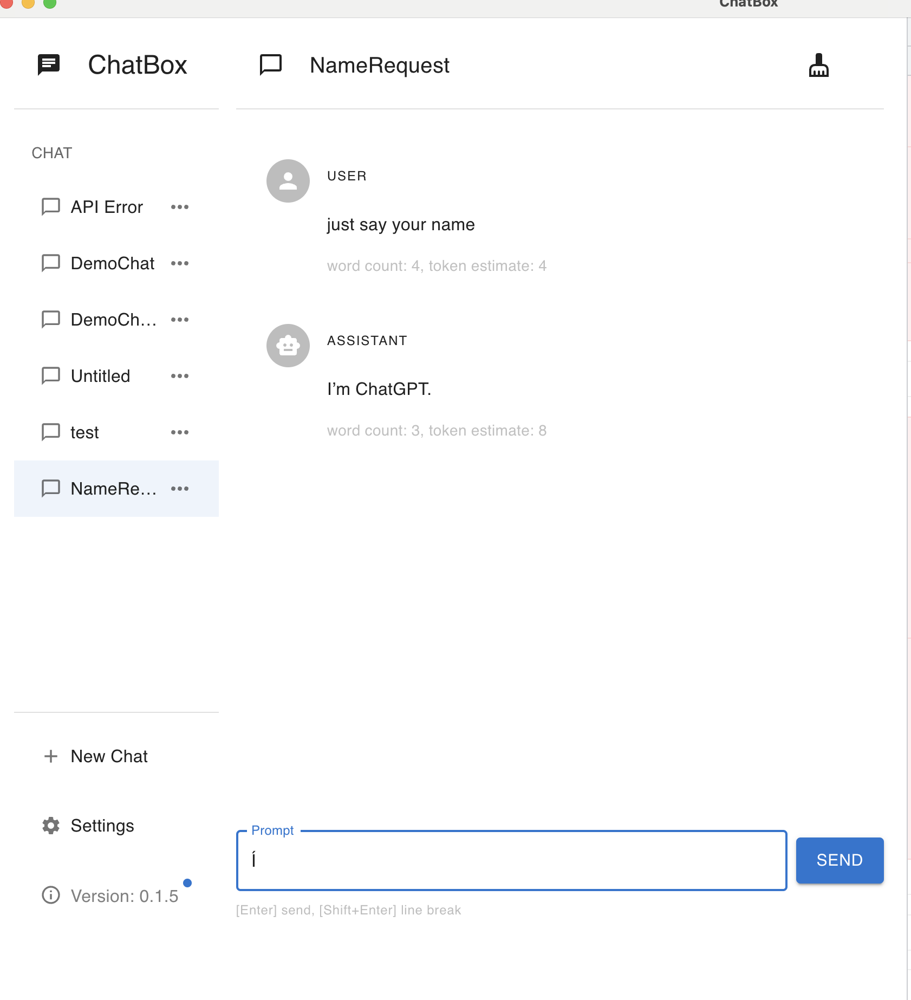
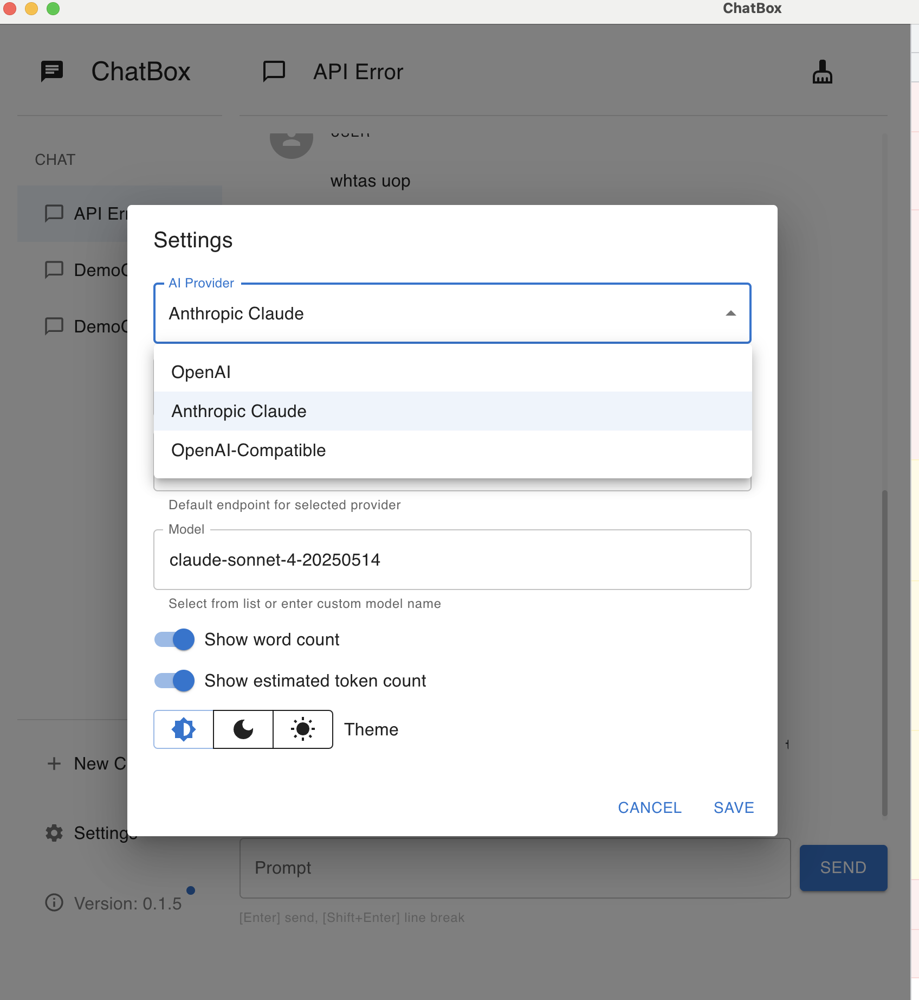

## Metadata

This issue DNE in the chatbox repo as of now. I have created it.
PR - https://github.com/mvs6909/chatbox/pull/5

# Add multi-provider AI support with dynamic model selection

## Motivation

The original chatbox application was hardcoded to work exclusively with OpenAI's API. This limitation prevented users from leveraging other powerful AI providers like Anthropic's Claude or custom OpenAI-compatible endpoints. As the AI landscape evolves with multiple high-quality providers offering different capabilities and pricing models, users need the flexibility to choose their preferred AI service.

Transforming the chatbox into a universal multi-provider chat application enables users to:
- Switch between OpenAI, Anthropic Claude, and custom OpenAI-compatible APIs
- Dynamically fetch and select from available models for each provider
- Compare responses across different AI providers
- Avoid vendor lock-in and choose the best provider for their use case

This enhancement maintains backward compatibility while unlocking the full potential of modern AI services.

## Current Behavior

The chatbox application is hardcoded to use OpenAI's API exclusively. The settings only allow configuration of an OpenAI API key and host, with no option to select different AI providers or their specific models.

**Reproduction Steps:**

1. Open the chatbox application and navigate to Settings
2. Observe: Only "API Key" and "API Host" fields are available, assuming OpenAI
3. Attempt to use an Anthropic API key
4. Observe: The application fails with "failed to fetch" errors because it's calling OpenAI endpoints with Anthropic authentication
5. Check the code in `src/devtools/client.ts`
6. Observe: The endpoint is hardcoded to `/v1/chat/completions` (OpenAI-specific) and model is hardcoded to `gpt-3.5-turbo`

## Expected Behavior

Users should be able to select their AI provider (OpenAI, Anthropic Claude, or OpenAI-Compatible) from a dropdown in settings. When a provider is selected, the application should:
- Automatically set the appropriate default API endpoint for that provider
- Dynamically fetch available models from the provider's API
- Allow users to select from fetched models or enter a custom model name
- Route chat requests to the correct endpoint with provider-specific authentication and message formatting

**Acceptance Criteria:**

- [ ] Settings UI includes a provider selection dropdown with options: OpenAI, Anthropic Claude, and OpenAI-Compatible
- [ ] When provider is changed, the API host automatically updates to the correct default endpoint
- [ ] Application dynamically fetches available models from each provider's `/v1/models` endpoint (with provider-specific authentication)
- [ ] Model selection UI displays fetched models in an autocomplete dropdown with support for custom model names
- [ ] Chat messages are routed through provider-specific adapters that handle:
  - [ ] Correct API endpoints (OpenAI: `/v1/chat/completions`, Anthropic: `/v1/messages`)
  - [ ] Provider-specific authentication headers (OpenAI: `Authorization: Bearer`, Anthropic: `x-api-key` + `anthropic-version`)
  - [ ] Different request body formats (Anthropic requires `max_tokens` and separates system messages)
  - [ ] Different streaming response formats (OpenAI: SSE with `[DONE]`, Anthropic: `content_block_delta` events)
- [ ] Settings migration logic handles backward compatibility, converting old `openaiKey` field to generic `apiKey`
- [ ] CORS is properly configured in Electron to allow API requests to different provider domains
- [ ] Model fetching includes 24-hour caching to avoid rate limits
- [ ] Error handling displays provider-specific error messages with proper context
- [ ] Session data stores which provider and model were used for each conversation
- [ ] All TypeScript types are properly updated to support the new provider system

## Verification

**Manual Testing:**
1. Open the application and navigate to Settings
2. Verify the "AI Provider" dropdown displays: OpenAI, Anthropic Claude, OpenAI-Compatible
3. Select "OpenAI" and enter a valid OpenAI API key
4. Verify the API host defaults to `https://api.openai.com`
5. Verify the model dropdown fetches and displays OpenAI models (gpt-4, gpt-3.5-turbo, etc.)
6. Select a model and send a test chat message
7. Verify the chat works correctly with OpenAI

**Anthropic Provider Testing:**
1. Select "Anthropic Claude" from the provider dropdown
2. Verify the API host automatically changes to `https://api.anthropic.com`
3. Enter a valid Anthropic API key
4. Verify the model dropdown fetches and displays Anthropic models (claude-sonnet-4, claude-opus-3, etc.)
5. Select a model and send a test chat message
6. Verify the chat works correctly with Anthropic Claude

**OpenAI-Compatible Testing:**
1. Select "OpenAI-Compatible" from the provider dropdown
2. Enter a custom API endpoint (e.g., `https://api.groq.com`)
3. Enter the corresponding API key
4. Verify the model dropdown shows fallback models with option to enter custom model name
5. Send a test chat message
6. Verify the chat works with the custom endpoint

**Error Handling:**
1. Enter an invalid API key and attempt to fetch models
2. Verify a clear error message is displayed with a "Retry" button
3. Attempt to send a chat message with invalid credentials
4. Verify the error message includes the provider name (e.g., `[anthropic] API Error: ...`)

**Migration Testing:**
1. If you have existing chatbox data with `openaiKey` in settings
2. Launch the updated application
3. Verify the settings are automatically migrated to use `apiKey` and `provider: 'openai'`
4. Verify old chat sessions still work correctly

**CORS Verification:**
1. Open DevTools (Cmd+Option+I) and check the Console tab
2. Change provider to Anthropic and enter API key
3. Verify no CORS errors appear when fetching models
4. Verify console logs show: `[anthropic] Calling API: https://api.anthropic.com/v1/messages`
5. Send a chat message and verify streaming works without CORS errors
