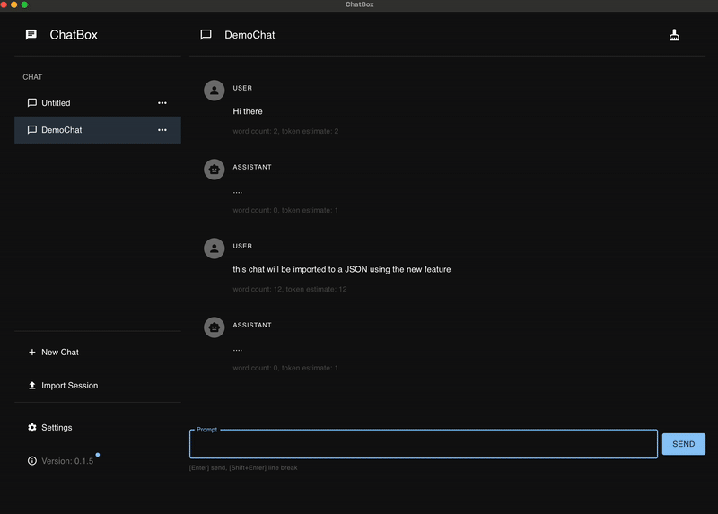

## Metadata

This issue DNE in the chatbox repo as of now. I have created it.
PR - https://github.com/mvs6909/chatbox/pull/4

# Add Export/Import functionality for chat sessions

## Motivation

Users of the chatbox application invest significant time creating valuable conversations with the AI assistant. Currently, there is no way to back up these conversations or transfer them between devices/installations. This creates several problems:

1. **Data Loss Risk**: If the application is uninstalled or the data directory is corrupted, all conversation history is permanently lost
2. **No Portability**: Users cannot move their chat history to a new computer or share interesting conversations with colleagues
3. **Limited Collaboration**: Teams cannot exchange useful prompt templates or debugging sessions stored as chat histories

Adding export/import functionality provides users with data ownership, portability, and peace of mind. This is a fundamental feature expected in any application that stores user-generated content. It also opens possibilities for users to back up their data, migrate between devices, or even build external tools that work with their chat data.

## Current Behavior

The chatbox application stores all chat sessions persistently using `electron-store`, but provides no mechanism for users to access this data in a portable format. Users can create, edit, and delete chat sessions, but cannot:

- Save their conversations to a file they control
- Load previously saved conversations
- Migrate their chat history to another machine
- Create backups of important conversations

**Reproduction Steps:**

1. Launch the chatbox application
2. Create a new chat session with several messages back and forth with the AI
3. Look through all menu options and UI elements in the application
4. Observe: There is no "Export" or "Import" button/menu option available
5. Try to locate where chat data is stored on disk (it's in an electron-store database, not user-accessible)
6. Observe: No way to extract or load chat sessions in a portable format

## Expected Behavior

Users should be able to export their chat sessions to a standard JSON file format and import previously exported sessions back into the application. The feature should handle edge cases gracefully, including duplicate sessions, invalid data, and merge conflicts.

**Acceptance Criteria:**

- [ ] Export functionality: Users can export one chat session to a JSON file via a clearly visible UI control in menu button
- [ ] Import functionality: Users can import chat sessions from a valid JSON file, with the session appearing in their session list
- [ ] Data validation: The import process validates the JSON structure and shows clear error messages for invalid files
- [ ] Duplicate handling: When importing a session with an ID that already exists, the system handles this gracefully (either by generating a new ID, skipping, or prompting the user)
- [ ] User feedback: Success and error states are clearly communicated to the user via toast notifications or dialogs
- [ ] File dialogs: Standard OS file picker dialogs are used for selecting export location and import file
- [ ] Data integrity: Exported data includes all session information (id, name, messages with roles and content) and can be re-imported without data loss

## Verification

**Manual Testing:**

1. **Export Test**:
   - Create 2-3 chat sessions with multiple messages
   - Click the Export button/menu
   - Select a save location in the file dialog
   - Verify a JSON file is created at the selected location
   - Open the JSON file and verify it contains readable session data with all messages

2. **Import Test**:
   - Delete one of the chat sessions from the application
   - Click the Import button/menu
   - Select the previously exported JSON file
   - Verify the session reappears in the session list with all messages intact

3. **Error Handling Test**:
   - Try to import an invalid JSON file (create a .json file with random text)
   - Verify a clear error message is displayed
   - Try to import a JSON file with valid JSON but wrong structure
   - Verify appropriate validation error is shown

4. **Duplicate Handling Test**:
   - Export an existing session
   - Import the same file without deleting the original session
   - Verify the application handles the duplicate ID gracefully (no crash, clear behavior)

5. **Cross-Session Test**:
   - Export sessions from the application
   - Close and reopen the application (or test on different installation if available)
   - Import the sessions
   - Verify all data is preserved and functional

**Expected Outcomes:**
- All export operations should produce valid, readable JSON files
- All import operations with valid data should restore sessions completely
- Invalid imports should fail gracefully with helpful error messages
- The application should never crash or lose data during export/import operations
