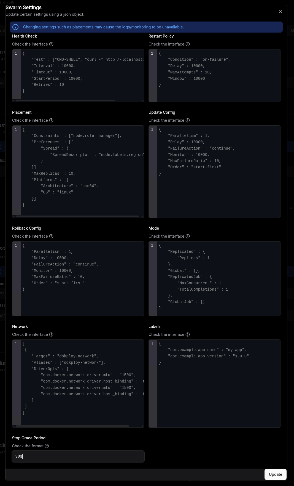
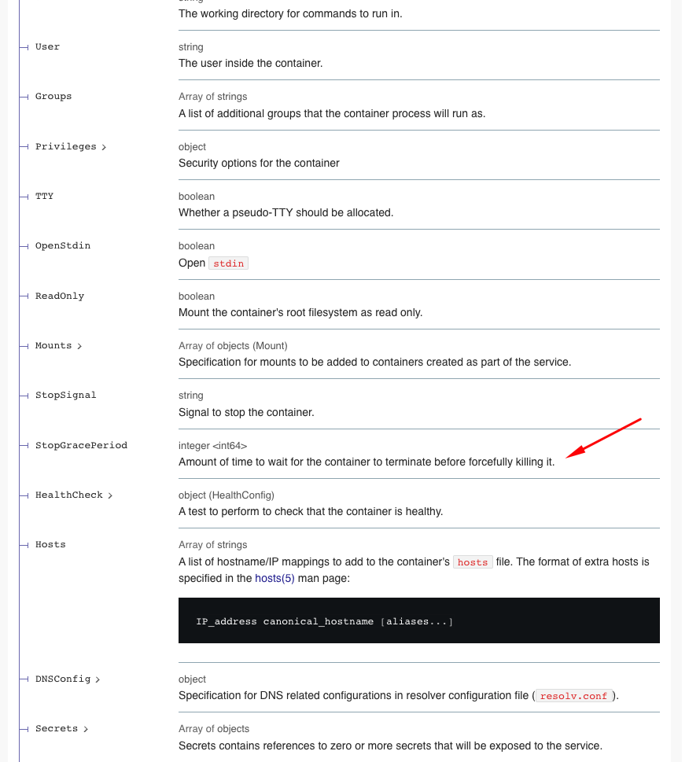

## Metadata

- **Tool:** [OpenBootstrap](https://openbootstrap.onrender.com/pr/Dokploy/dokploy/2232)
- **PR:** [dokploy/dokploy#2232](https://github.com/Dokploy/dokploy/pull/2232)
- **Issue:** https://github.com/Dokploy/dokploy/issues/2227
- **Difficulty**: Medium-hard

# Add stop_grace_period configuration for Docker Swarm services

## Motivation

When deploying applications with long-lived connections (WebSockets, TCP streams, database connections), Docker's default 10-second grace period is often insufficient for graceful shutdowns. During rolling updates or redeployments, containers are forcefully killed before they can properly drain active connections, resulting in dropped sessions and brief downtime for end users.

Docker Swarm and Docker Compose both support configuring `stop_grace_period` to allow containers more time to handle shutdown signals and close connections cleanly. However, Dokploy currently provides no way to configure this setting through its interface, forcing teams to either accept connection drops during deployments or abandon Dokploy's application mode in favor of manually maintaining Compose/Swarm files. Adding this configuration option would enable true zero-downtime deployments for stateful applications while maintaining Dokploy's streamlined deployment experience.

## Current Behavior

Dokploy does not expose any configuration option for Docker's `stop_grace_period` setting. When services are updated or redeployed, containers are stopped with Docker's default 10-second grace period, regardless of the application's needs.

**Reproduction Steps:**
1. Deploy an application in Dokploy that maintains long-lived WebSocket connections or database connections
2. Navigate to the application's advanced settings or swarm configuration panel
3. Look for any option to configure graceful shutdown timeout or stop grace period
4. Observe: No such configuration option exists
5. Trigger a redeployment or rolling update of the service
6. Observe: Active connections are dropped after 10 seconds when the container is forcefully killed
7. Expected: Applications needing longer shutdown times (30-60+ seconds) have no way to configure this through Dokploy's interface

## Expected Behavior

Users should be able to configure the `stop_grace_period` for their Docker Swarm services directly through Dokploy's interface. This setting should be stored in the database, exposed through the API, and properly passed to Docker when creating or updating services.

**Acceptance Criteria:**
- [ ] A new database field stores the stop grace period value (in nanoseconds to match Docker's API) for applications and all database service types (postgres, mariadb, mongo, mysql, redis)
- [ ] The swarm settings UI includes an input field for configuring stop grace period with helpful documentation about the expected format
- [ ] When creating or updating Docker Swarm services, the configured stop grace period is properly passed to Docker's API
- [ ] The value is correctly handled as a BigInt in TypeScript and converted appropriately when interfacing with Docker
- [ ] When the field is null or unset, the setting is omitted from Docker service configuration (allowing Docker's default behavior)

## Verification

**Manual Testing:**
1. Run the database migration to add the new column to all relevant tables
2. Start the Dokploy application and navigate to an application's advanced swarm settings
3. Verify a "Stop Grace Period" input field appears with helpful tooltip documentation
4. Enter a value (e.g., 30000000000 for 30 seconds) and save the settings
5. Deploy or update the application
6. Inspect the created Docker service using `docker service inspect <service-name>` and verify the `StopGracePeriod` field matches your configured value
7. Test with a null/empty value and verify the field is omitted from the Docker service configuration

## Hints

#### Local Development Setup:

You don't need a remote server to test Dokploy! If you have Docker installed on your PC, you can deploy and test locally.
Remote servers and the Dokploy server share the same code at deployment time for applications.
Simply hit deploy and it should work locally.
Important: Make sure to install the builders first: Installation Guide

#### Testing Approach:
To properly test your changes, try these scenarios:

#### Application Testing:

Create an empty application
Test saving different values for Stop Grace Period (including empty values)
Deploy a simple image (e.g., whoami) with the application
Verify the Stop Grace Period behavior

#### Database Testing:

Create a MySQL database and deploy it
Change the Stop Grace Period setting
Re-deploy and verify the changes persist correctly

## Submission
Download https://cap.so/ to record your screen (use Studio mode). Export as an mp4, and drag and drop into an issue comment below.

Guide to submitting pull requests: https://hackmd.io/@timothy1ee/Hky8kV3hlx