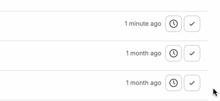
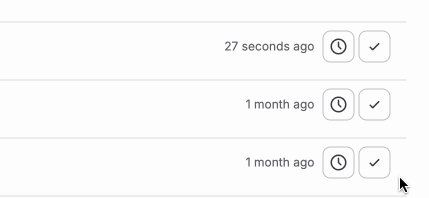

# Metadata

- **Tool:** [OpenBootstrap](https://openbootstrap.onrender.com/pr/gitlab-org/gitlab/206576)
- **PR:** [gitlab-org/gitlab#206576](https://gitlab.com/gitlab-org/gitlab/-/merge_requests/206576)
- **Issue:** N/A
- **Difficulty:** Easy

# Tooltip persists after clicking to-do action buttons

## Motivation

When users interact with to-do items on the to-do list page, they expect tooltips to disappear after clicking action buttons (like "Mark as done" or "Re-add to-do"). Currently, tooltips remain visible on screen after the button is clicked, creating visual clutter and a poor user experience. This is a common UI pattern issue where transient UI elements (like tooltips) need proper lifecycle management to ensure they don't persist beyond their intended context.

Fixing this improves the overall polish of the interface and prevents confusion where stale tooltips might mislead users about what they're hovering over or what actions are available.

## Current Behavior

On the to-do list page, when users hover over action buttons (such as "Mark as done" or "Re-add to-do"), a tooltip appears to provide additional context. However, after clicking these buttons, the tooltip remains visible on the page instead of being dismissed. This creates a situation where tooltips accumulate or persist inappropriately, degrading the user experience.

**Reproduction Steps:**
1. Navigate to the to-do list page (typically at `/dashboard/todos`)
2. Ensure you have at least one to-do item in your list
3. Hover over the "Mark as done" button on a to-do item to trigger the tooltip
4. Click the button while the tooltip is visible
5. Observe: The tooltip remains visible on the page after the click action completes, even though the mouse may have moved away or the button state has changed

## Expected Behavior

Tooltips should be automatically dismissed when users click on the associated button. The tooltip should disappear immediately after the click event, ensuring a clean interface without lingering UI elements. This follows standard tooltip behavior patterns where transient informational overlays are removed once the user takes action.

**Acceptance Criteria:**
- [ ] Clicking the "Mark as done" button dismisses its tooltip immediately after the click
- [ ] Clicking the "Re-add to-do" button dismisses its tooltip immediately after the click
- [ ] Tooltips do not persist on the page after button interactions
- [ ] Normal tooltip hover behavior still works correctly (tooltip appears on hover, disappears on mouseout when not clicking)
- [ ] The fix applies to all to-do action buttons that display tooltips

## Verification

**Manual Testing:**
1. Navigate to the to-do list page
2. Hover over a to-do action button to display the tooltip
3. Click the button
4. Verify the tooltip disappears immediately after the click
5. Repeat for different action buttons (mark as done, re-add to-do)
6. Verify normal hover behavior still works: hover over a button without clicking and move mouse away - tooltip should disappear

Look for: Clean UI with no lingering tooltips after button clicks, while maintaining normal tooltip hover/mouseout functionality.

### Submission
Download https://cap.so/ to record your screen (use Studio mode). Export as an mp4, and drag and drop into an issue comment below.

Guide to submitting pull requests: https://hackmd.io/@timothy1ee/Hky8kV3hlx
