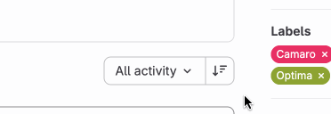

# Metadata

- **Tool:** [OpenBootstrap](https://openbootstrap.onrender.com/pr/gitlab-org/gitlab/206956)
- **PR:** [gitlab-org/gitlab#206956](https://gitlab.com/gitlab-org/gitlab/-/merge_requests/206956)
- **Issue:** N/A
- **Difficulty** - Easy

# Sort direction tooltip persists after mouse leaves button

## Motivation
Tooltips should disappear when the mouse leaves the trigger element. Persistent tooltips clutter the UI, obscure content, and disrupt user interactions, especially in areas with multiple controls. Consistent tooltip behavior is essential for a polished and accessible user experience.

## Current Behavior

The sort direction button in the merge request activity section displays a tooltip when hovered, but the tooltip does not disappear when the mouse leaves the button area. The tooltip remains visible on the screen even after the user has moved their cursor away from the sort direction button.

**Reproduction Steps:**
1. Navigate to any merge request page your own forked version.
2. Find the activity/discussion section
3. Locate the sort direction button (typically near the sort dropdown)
4. Click your mouse over the sort direction button to trigger the tooltip
5. Move your mouse away from the button to another area of the page
6. Observe: The tooltip remains visible on the screen instead of disappearing

## Expected Behavior

The sort direction tooltip should automatically disappear when the user moves their mouse away from the sort direction button, following standard tooltip interaction patterns used throughout the application.

**Acceptance Criteria:**
- [ ] Tooltip appears when hovering over the sort direction button
- [ ] Tooltip disappears immediately when the mouse leaves the button area after clicking the sort button
- [ ] Tooltip behavior is consistent with other tooltips in the application
- [ ] No JavaScript errors occur during tooltip show/hide interactions
- [ ] The fix works across different browsers (Chrome, Firefox, Safari)

## Verification

**Manual Testing:**
1. Navigate to a merge request page
2. Scroll to the activity section
3. Hover over the sort direction button and verify the tooltip appears
4. Move your mouse away from the button in different directions (up, down, left, right)
5. Confirm the tooltip disappears in all cases
6. Repeat the hover/mouseout action multiple times rapidly to ensure no edge cases
7. Test with keyboard navigation (tab to the button) to ensure tooltip behavior is appropriate

### Submission
Download https://cap.so/ to record your screen (use Studio mode). Export as an mp4, and drag and drop into an issue comment below.

Guide to submitting pull requests: https://hackmd.io/@timothy1ee/Hky8kV3hlx
