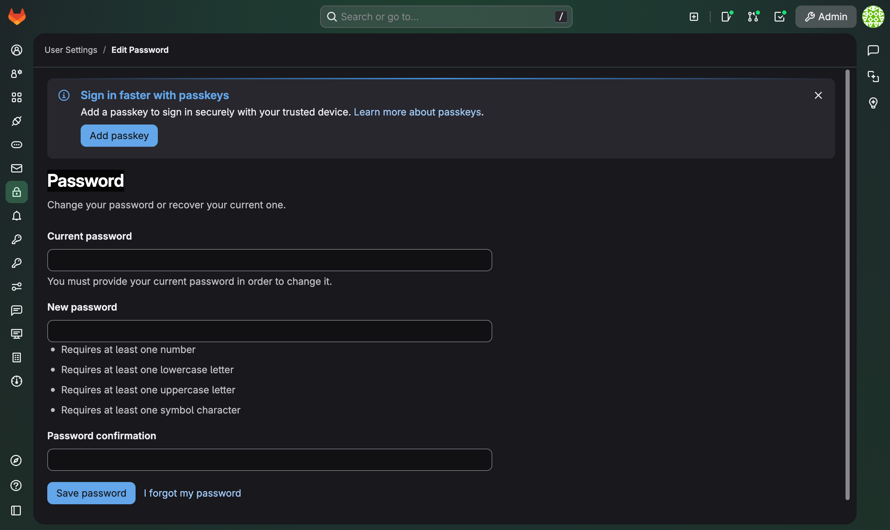
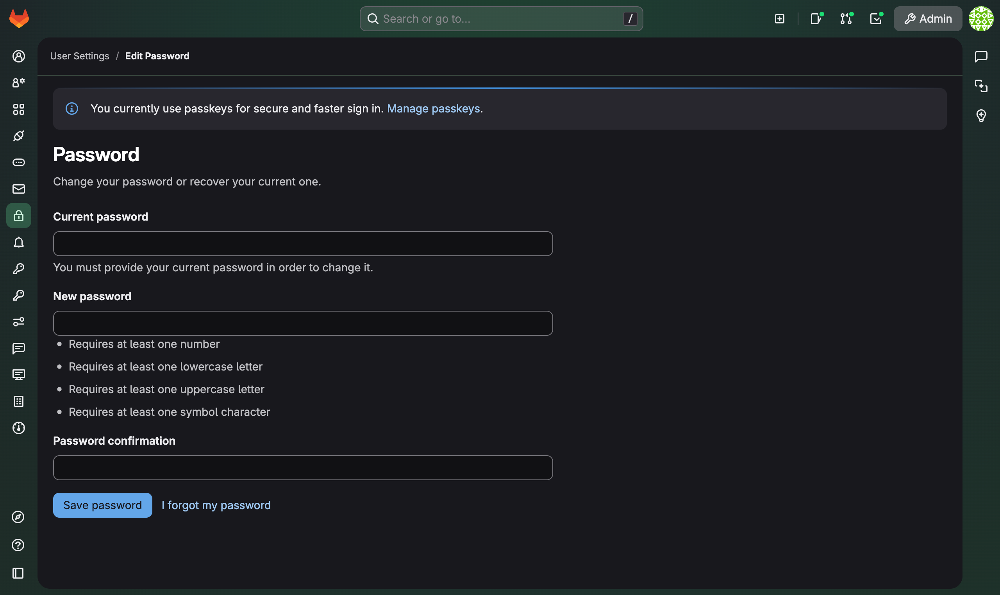

# Metadata

- **Tool:** [OpenBootstrap](https://openbootstrap.onrender.com/pr/gitlab-org/gitlab/206407)
- **PR:** [gitlab-org/gitlab#206407](https://gitlab.com/gitlab-org/gitlab/-/merge_requests/206407)
- **Issue:** N/A
- **Difficulty:** Easy-Medium

# Add alerts for passkeys in password page protected via feature flag

## Motivation

GitLab is developing passkey authentication functionality. This issue focuses on creating a new feature flag for passkeys and implementing conditional alerts on the password settings page. The feature flag will enable controlled rollout, while the alerts will provide users visibility into their passkey configuration status once the feature is enabled.

## Current Behavior

The password settings page does not display any information about the user's passkey configuration status. Users visiting this page have no visibility into whether they have passkeys set up or any guidance on how passkeys might enhance their account security.

**Reproduction Steps:**
1. Observe: The page displays password settings but no alerts or information about passkeys. `http://127.0.0.1:3000/-/user_settings/password/edit`

## Expected Behavior

The password settings page should display contextual alerts that inform users about their passkey status. The alert content and messaging should differ based on whether the user has passkeys configured:

| User State | Alert Behavior | Screenshot |
|------------|----------------|------------|
| **Without passkeys** | Display an alert encouraging users to set up passkeys, with appropriate links to documentation and the passkey configuration page |  |
| **With passkeys** | Display an alert acknowledging their existing passkeys, with relevant links for management |  |

**(Note: Currently, passkeys are not supported. You should mock this if-else using a separate new feature flag `user_passkey_enabled`)**

**Acceptance Criteria:**
- [ ] Create a new feature flag called `passkey` for passkey functionality under either `config/feature_flags/wip` or `config/feature_flags/development`.  
- [ ] An alert is displayed when the user has no passkeys configured (only when feature flag is enabled)
- [ ] A different alert is displayed when the user has at least one passkey configured (only when feature flag is enabled)
- [ ] Both alerts include appropriate links and placeholders for passkey documentation in the future
- [ ] The alerts only appear when the `passkey` feature flag is enabled
- [ ] The page layout is clean and focused on relevant settings

## Verification

**Manual Testing:**
1. Verify the `passkey` feature flag has been created and can be toggled
2. Enable the `passkey` feature flag at `https://127.0.0.1:3000/rails/features/passkey`
3. Navigate to `https://127.0.0.1:3000/-/user_settings/password` with a user account that has no passkeys
4. Verify that an appropriate alert is displayed for users without passkeys
5. Configure the user account to have at least one passkey (or test with a different user state)
6. Return to the password settings page
7. Verify that a different alert is displayed for users with passkeys
8. Confirm that both alerts contain relevant links and appropriate messaging
9. Disable the `passkey` feature flag and verify the alerts do not appear

**Expected Results:**
- The `passkey` feature flag is successfully created and functional
- Two distinct alert states are visible depending on passkey configuration (only when feature flag is enabled)
- Alerts provide clear, helpful information to users
- The UI is clean and professional
- Feature flag properly controls alert visibility

## Hints

<details>
<summary>Implementation Hints (Try to implement the feature without using these hints first)</summary>

- Feature flags in GitLab are typically stored in YAML files under `config/feature_flags/`
- Use the appropriate directory (`wip` or `development`) for the passkey feature flag
- For mocking passkey status, you can create an temporary additional feature flag `user_passkey_enabled` to simulate different user states
- Look for existing alert patterns in the GitLab codebase for consistent styling and behavior
- Consider using GitLab's existing UI components for alerts to maintain consistency
- You can toggle feature flags via
```bash
cd <<YOUR gitlab dir>>
bundle exec rails console
>> Feature.enable(:passkeys) // change state
>> Feature.enabled?(:passkeys) // check state
```
- Example feature flags YAML
```yml
---
name: passkeys
introduced_by_url:
rollout_issue_url:
milestone: '17.6'
type: development
group: group::authentication
default_enabled: false
```

</details>

### Submission
Download https://cap.so/ to record your screen (use Studio mode). Export as an mp4, and drag and drop into an issue comment below.

Guide to submitting pull requests: https://hackmd.io/@timothy1ee/Hky8kV3hlx
