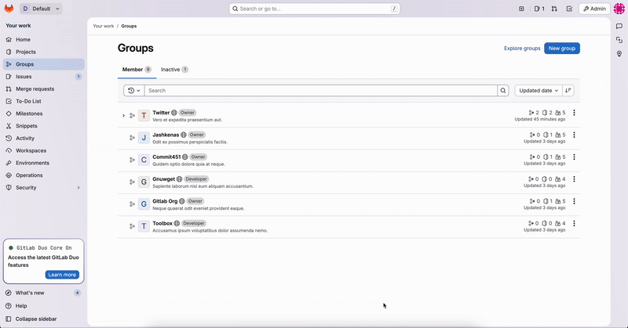

# Metadata

- **Tool:** [OpenBootstrap](https://openbootstrap.onrender.com/pr/gitlab-org/gitlab/206452)
- **PR:** [gitlab-org/gitlab#206452](https://gitlab.com/gitlab-org/gitlab/-/merge_requests/206452)
- **Issue:** https://gitlab.com/gitlab-org/gitlab/-/issues/556525
- **Difficulty:** Medium

# Refactor group list item actions to consolidate delete and leave functionality

## Motivation

The group list item actions component (`group_list_item_actions.vue`) currently contains some actions but is missing the delete and leave group functionality. This creates a fragmented architecture where group actions are split across multiple components, making the code less maintainable and harder to reuse.

We need to consolidate all group list actions into a single, portable component to support future feature development. Specifically, this component will need to be reused on the group detail page, which requires all actions to be self-contained within `group_list_item_actions.vue`. By moving the delete and leave actions into this component, we improve code organization, reduce duplication, and make the component truly portable for use across different parts of the application.

## Current Behavior

The group list item actions are currently split across multiple components. While `group_list_item_actions.vue` handles some actions, the delete and leave group functionality exists outside of this component in `group_list_item_actions.vue`. This architectural split makes the component less portable and harder to reuse in other contexts where group actions are needed.

**Reproduction Steps:**
1. Navigate to Your work -> Groups in the GitLab interface
2. Locate a group where you are a direct member (and ensure another owner exists for that group)
3. Open the actions menu for that group and observe the "Leave group" option
4. Locate a group you can delete and observe the "Delete" option in the actions menu
5. Navigate to the "Inactive" tab and observe the "Immediately delete" option for inactive groups
6. Examine the codebase to see where these action handlers are currently implemented
7. Observe: The delete and leave actions are not contained within `group_list_item_actions.vue` alongside the other group actions

## Expected Behavior

All group list item actions, including delete and leave functionality, should be consolidated within the `group_list_item_actions.vue` component. This creates a single, cohesive component that can be easily reused across different pages and contexts without requiring additional action handlers to be implemented separately.

**Note:** This isssue is a refactor. The UI will not reflect any changes to functionality. The GIF below shows the action items concerned for refactor

**Acceptance Criteria:**
- [ ] The leave group action is moved into `group_list_item_actions.vue` and functions correctly
- [ ] The delete group action is moved into `group_list_item_actions.vue` and functions correctly
- [ ] The immediately delete action (for inactive groups) is moved into `group_list_item_actions.vue` and functions correctly
- [ ] All three actions work as expected with no visual or functional changes to the user experience
- [ ] The component remains properly encapsulated and portable for reuse in other contexts

## Verification

**Manual Testing:**
1. Navigate to Your work -> Groups
2. Test the "Leave group" action on a group where you are a direct member and another owner exists - verify you can successfully leave the group
3. Test the "Delete" action on a group you own - verify the deletion flow works correctly
4. Navigate to the "Inactive" tab
5. Test the "Immediately delete" action on an inactive group - verify it deletes successfully
6. Confirm that all actions display the same UI and behavior as before the refactor

**Automated Testing:**
Run the relevant test suites to ensure no regressions were introduced:
- Execute frontend component tests for the groups functionality
- Verify all existing tests pass without modification (or update tests if they were testing implementation details rather than behavior)

### Submission
Download https://cap.so/ to record your screen (use Studio mode). Export as an mp4, and drag and drop into an issue comment below.

Guide to submitting pull requests: https://hackmd.io/@timothy1ee/Hky8kV3hlx
