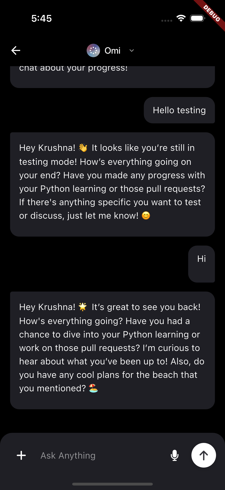

# Metadata

- **Tool:** [OpenBootstrap](https://openbootstrap.onrender.com/pr/BasedHardware/omi/2901)
- **PR:** [BasedHardware/omi#2901](https://github.com/BasedHardware/omi/pull/2901)
- **Difficulty:** Easy

# Submit button should be disabled and grayed out when input field is empty

## Motivation

Good user experience requires clear visual feedback about which actions are available. When an input field is empty, allowing users to click a submit button creates confusion and unnecessary interactions. The button should visually communicate its disabled state through both styling (grayed out appearance) and behavior (non-interactive).

This enhancement improves the chat interface by preventing users from attempting to send empty messages and providing immediate visual feedback about the button's state. It follows standard UI/UX patterns where disabled buttons are visually distinct from active ones, reducing user frustration and creating a more polished experience.

## Current Behavior

The submit button in the chat interface remains fully styled and appears clickable even when the text input field is empty. While the button may have logic to prevent sending empty messages, it doesn't provide visual feedback to users that the action is unavailable. This creates a disconnect between the visual state and the actual functionality.

**Reproduction Steps:**
1. Navigate to the chat page in the application
2. Ensure the text input field is completely empty (no text entered)
3. Observe the submit button (arrow up icon in a circular container)
4. Expected: Button should appear disabled/grayed out
5. Actual: Button appears fully active with white background and normal styling

## Expected Behavior

The submit button should dynamically update its appearance based on the input field's content. When the input field is empty or contains only whitespace, the button should be visually disabled with a grayed-out appearance and should not respond to tap interactions. When valid text is entered, the button should return to its active state with full styling.

**Acceptance Criteria:**
- [ ] Submit button appears grayed out (reduced opacity or gray color) when input field is empty
- [ ] Submit button becomes active and fully styled when text is entered in the input field
- [ ] Button state updates reactively as the user types or deletes text
- [ ] Tapping the grayed-out button produces no action or haptic feedback
- [ ] Button considers other existing conditions (sending state, uploading files, connectivity) in addition to text content

## Verification

**Manual Testing:**
1. Open the chat page with an empty input field and verify the submit button appears grayed out
2. Type a single character and verify the button immediately becomes active with full styling
3. Delete all text and verify the button returns to the grayed-out state
4. Type several spaces (whitespace only) and verify the button remains grayed out
5. Enter valid text and tap the button to confirm it still sends messages correctly
6. Verify the button respects other disabled states (during message sending, file uploads, or no connectivity)

**Expected Results:**
- Button visual state changes are immediate and smooth
- No console errors or warnings
- Message sending functionality remains intact when button is active
- All existing button behavior (haptic feedback, connectivity checks) continues to work

### Submission
Download https://cap.so/ to record your screen (use Studio mode). Export as an mp4, and drag and drop into an issue comment below.

Guide to submitting pull requests: https://hackmd.io/@timothy1ee/Hky8kV3hlx