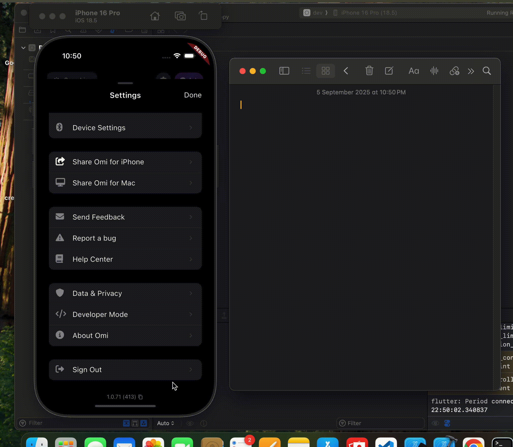

# Metadata

- **Tool:** [OpenBootstrap](https://openbootstrap.onrender.com/pr/BasedHardware/omi/2933)
- **PR:** [BasedHardware/omi#2933](https://github.com/BasedHardware/omi/pull/2933)
- **Difficulty:** Easy

# Add copy button for app version and device information

## Motivation

When users report issues or request support, the support team needs to know the app version and device information to effectively troubleshoot problems. Currently, users must manually type out this information or take screenshots, which is error-prone and time-consuming. This creates friction in the support process and can lead to incomplete or inaccurate information being provided.

By adding a simple copy button next to the version information in the settings, users can quickly copy all relevant troubleshooting details (app version, build number, device model, and OS version) to their clipboard with a single tap. This improves the support experience for both users and the support team, making it easier to gather the technical details needed for effective troubleshooting.

## Current Behavior

The app displays version information in the settings drawer, but there is no way to easily copy this information. Users who need to share their version details for support purposes must:
- Manually type out the version number
- Take a screenshot and share the image
- Try to remember the version number

This makes it difficult to quickly provide accurate version information when reporting issues or requesting help.

**Reproduction Steps:**
1. Open the app and navigate to the Settings drawer
2. Scroll to the bottom where the version information is displayed
3. Attempt to copy the version number to share with support
4. Observe: There is no copy functionality available - the text cannot be selected or copied

## Expected Behavior

The settings drawer should display the app version and device information with a copy button that allows users to quickly copy all relevant troubleshooting details to their clipboard. When tapped, the button should copy a formatted string containing the app version, build number, device model, and operating system version, then provide visual feedback to confirm the copy action was successful.

**Acceptance Criteria:**
- [ ] A copy button is displayed next to the version information in the settings drawer
- [ ] Tapping the copy button copies app version, build number, and device information to the clipboard
- [ ] The copied text includes device model and OS version (e.g., "iPhone 14 — iOS 17.2")
- [ ] Visual feedback (such as a snackbar or toast) confirms the information was copied successfully
- [ ] The feature works correctly on both iOS and Android platforms

## Verification

**Manual Testing:**
1. Open the app and navigate to the Settings drawer
2. Scroll to the bottom to view the version information section
3. Tap the copy button next to the version information
4. Verify that a confirmation message appears indicating the copy was successful
5. Open any text input field (Notes app, Messages, etc.) and paste
6. Confirm that the pasted text includes:
   - App version number
   - Build number
   - Device model/name
   - Operating system and version
7. Repeat testing on both iOS and Android devices to ensure platform-specific device information is correctly retrieved

**Expected Result:**
The copied text should be formatted clearly and include all relevant information needed for support troubleshooting. The copy action should work reliably and provide immediate feedback to the user.

### Submission
Download https://cap.so/ to record your screen (use Studio mode). Export as an mp4, and drag and drop into an issue comment below.

Guide to submitting pull requests: https://hackmd.io/@timothy1ee/Hky8kV3hlx