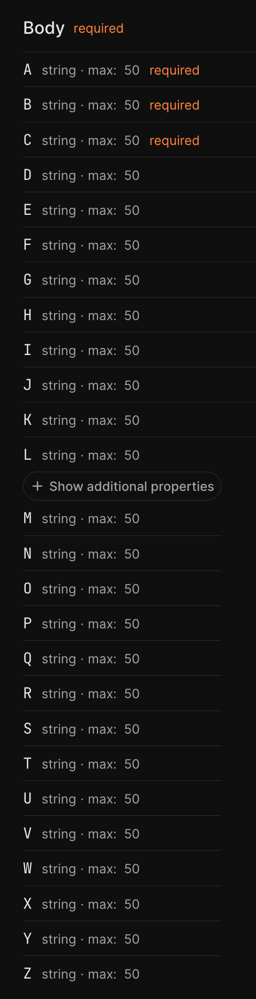

## Metadata (not to include in the student issue)

PR Link - https://github.com/scalar/scalar/pull/6138
Issue link (sub-issue) - https://github.com/scalar/scalar/issues/5987
Tool - https://openbootstrap.onrender.com/pr/scalar/scalar/6138
**Notes** - Should we add a bonus section on front-end testing? It might be beyond the scope of what's needed for students' initial work.

# Title: Issue #1 [Bug] “Show Additional Properties” button for API Reference is not working as expected

# "Show additional properties" button displays but does not expand/collapse properties

## Motivation

The API Reference component includes a feature to limit the number of properties displayed for schemas with many fields, improving readability and reducing visual clutter. When a schema has numerous properties, users should see a subset initially with an option to expand and view all properties via a "Show additional properties" button. This progressive disclosure pattern is essential for maintaining a clean, scannable interface while still providing access to complete schema information when needed.

Currently, this feature is broken: the expand button appears but clicking it does nothing, and all properties are displayed by default regardless of the button's state. This creates a confusing user experience where the UI suggests interactivity that doesn't function, and defeats the purpose of the progressive disclosure pattern entirely.

## Current Behavior

When rendering a schema with many properties in the API Reference, the "Show additional properties" button is displayed, but it is non-functional. All properties are shown immediately on page load, and clicking the button does not change what is displayed. The disclosure state is not properly controlling the visibility of the properties list.

**Reproduction Steps:**

1. Save this file `testopenapi.json` under `scalar/packages/api-reference/`
```
{
  "openapi": "3.0.1",
  "paths": {
    "/Test": {
      "post": {
        "summary": "Test",
        "operationId": "Test",
        "requestBody": {
          "content": {
            "application/json": {
              "schema": {
                "$ref": "#/components/schemas/TestRequest"
              }
            }
          },
          "required": true
        },
        "responses": {
          "204": {
            "description": "No Content"
          }
        }
      }
    }
  },
  "components": {
    "schemas": {
      "TestRequest": {
        "required": [
          "A",
          "B",
          "C"
        ],
        "type": "object",
        "properties": {
          "A": {
            "maxLength": 50,
            "type": "string"
          },
          "B": {
            "maxLength": 50,
            "type": "string"
          },
          "C": {
            "maxLength": 50,
            "type": "string"
          },
          "D": {
            "maxLength": 50,
            "type": "string"
          },
          "E": {
            "maxLength": 50,
            "type": "string"
          },
          "F": {
            "maxLength": 50,
            "type": "string"
          },
          "G": {
            "maxLength": 50,
            "type": "string"
          },
          "H": {
            "maxLength": 50,
            "type": "string"
          },
          "I": {
            "maxLength": 50,
            "type": "string"
          },
          "J": {
            "maxLength": 50,
            "type": "string"
          },
          "K": {
            "maxLength": 50,
            "type": "string"
          },
          "L": {
            "maxLength": 50,
            "type": "string"
          },
          "M": {
            "maxLength": 50,
            "type": "string"
          },
          "N": {
            "maxLength": 50,
            "type": "string"
          },
          "O": {
            "maxLength": 50,
            "type": "string"
          },
          "P": {
            "maxLength": 50,
            "type": "string"
          },
          "Q": {
            "maxLength": 50,
            "type": "string"
          },
          "R": {
            "maxLength": 50,
            "type": "string"
          },
          "S": {
            "maxLength": 50,
            "type": "string"
          },
          "T": {
            "maxLength": 50,
            "type": "string"
          },
          "U": {
            "maxLength": 50,
            "type": "string"
          },
          "V": {
            "maxLength": 50,
            "type": "string"
          },
          "W": {
            "maxLength": 50,
            "type": "string"
          },
          "X": {
            "maxLength": 50,
            "type": "string"
          },
          "Y": {
            "maxLength": 50,
            "type": "string"
          },
          "Z": {
            "maxLength": 50,
            "type": "string"
          }
        }
      }
    }
  }
}
```
2. Update the `packages/api-reference/index.html` to include the OpenAPI spec created in step 1
```
          {
            title: 'Bolt',
            url: 'https://assets.bolt.com/external-api-references/bolt.yml',
          },
          {
            title: 'OpenStatus',
            url: 'https://api.openstatus.dev/v1/openapi',
          },
+          {
+            title: 'Reproducing Issue',
+            url: 'testopenapi.json',
+          },
        ],
        persistAuth: true,
        // Avoid CORS issues
        proxyUrl: 'https://proxy.scalar.com',
      })
```

3. Run `pnpm dev:reference` to spin up the API Reference locally.
4. Click the drop down on the top left and select `Reproducing Issue`.
5. Notice the `Show Additional Properties` being non-functional.
## Screenshot: Current Broken Behavior

<details>
  <summary>Show screenshot of current broken behavior</summary>

  

</details>


## Expected Behavior

When a schema has many properties, only a limited number should be displayed initially. The "Show additional properties" button should toggle the visibility of the remaining properties. Clicking the button should expand the list to show all properties, and the button text/state should update accordingly.

<details>
  <summary>Show screenshot of fixed toggle behavior</summary>

  

</details>


**Acceptance Criteria:**

- [ ] Initially only a subset of properties is visible.
- [ ] Clicking the "Show additional properties" button expands the disclosure and reveals all properties. 

## Verification

**Manual Testing:**
1. Load the example OpenAPI document provided in the reproduction steps
2. Navigate to the Reproducing Issue example.
3. Verify that initially only a limited number of properties are shown (not all 26)
4. Click the "Show additional properties" button
5. Verify that all properties (A through Z) are now visible
6. Confirm the button state/text updates to reflect the expanded state

**Automated Testing:**
1. Run the test suite: `pnpm test Schema.test.ts`

