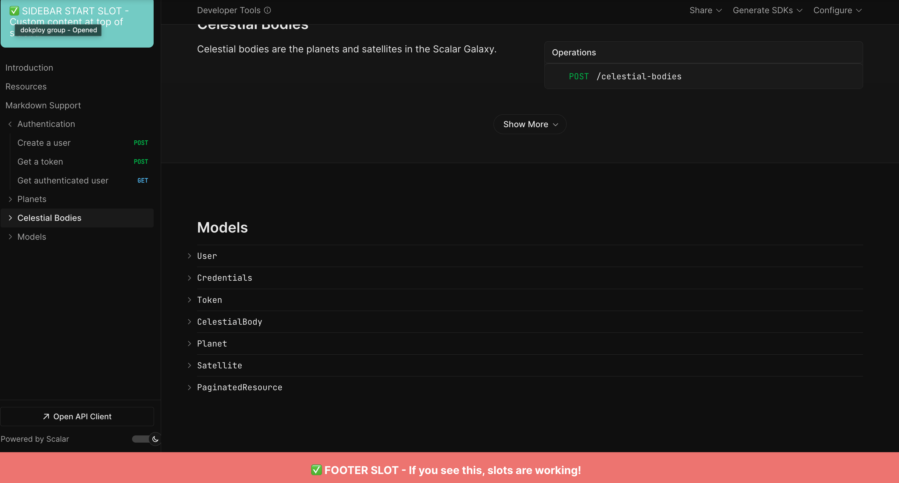

## Metadata (not to include in the student issue)

- PR Link: https://github.com/scalar/scalar/pull/6735/files
- Issue link: NA
- Tool: https://openbootstrap.onrender.com/pr/scalar/scalar/6735
- Diufficulty: Easy

# Expose customization slots in ApiReference component

## Motivation

The `ApiReference` component serves as the main entry point for developers using the API reference UI, but it currently doesn't expose any customization slots. This limits developers' ability to extend or customize the reference documentation interface with their own content. The underlying `ApiReferenceWorkspace` component already provides several slots for customization (footer, content areas, sidebar sections), but these aren't accessible when using the higher-level `ApiReference` component.

By exposing these slots, developers can add custom branding, additional navigation, supplementary content, or other UI elements to their API documentation without having to fork or modify the component itself. This improves the component's flexibility and makes it more suitable for diverse use cases.

## Current Behavior

The `ApiReference` component does not expose any slots for customization. Developers who want to add custom content to the footer, sidebar, or content areas must either use the lower-level `ApiReferenceWorkspace` component directly (losing the convenience of `ApiReference`) or cannot customize these areas at all.

**Reproduction Steps:**
1. Create a Vue application that uses the `ApiReference` component. See hints for example
2. Attempt to pass custom content through slots like `footer`, `sidebar-start`, `sidebar-end`, or `content-end`
3. Observe: The slots are not recognized and custom content does not render
4. Check the component's TypeScript definitions
5. Observe: No slots are defined in the component's API

## Expected Behavior

The `ApiReference` component should expose all customization slots that are available in the underlying `ApiReferenceWorkspace` component, allowing developers to inject custom content into key areas of the API reference interface. These slots should be properly typed using Vue 3's `defineSlots` API for TypeScript support.

**Acceptance Criteria:**
- [ ] The `footer` slot is exposed and renders content in the footer area
- [ ] The `content-end` slot is exposed and renders content at the end of the main content area
- [ ] The `sidebar-start` slot is exposed and renders content at the start of the sidebar
- [ ] The `sidebar-end` slot is exposed and renders content at the end of the sidebar
- [ ] All slots are properly typed using TypeScript's `defineSlots` API
- [ ] Slot content passed to `ApiReference` is correctly forwarded to the corresponding slots in `ApiReferenceWorkspace`

## Verification

**Manual Testing:**
1. Create a test page that uses the `ApiReference` component
2. Pass custom content to each of the four slots (`footer`, `content-end`, `sidebar-start`, `sidebar-end`)
3. Verify that the custom content renders in the correct location for each slot
4. Check that TypeScript provides proper autocomplete and type checking for the slot names

**Type Checking:**
1. Run TypeScript compilation on the component files
2. Verify that no type errors are introduced
3. Confirm that the slots are properly typed and show up in IDE autocomplete when using the component

## Hints

**Reproduction**
1. Create a Vue app in a new file under `packages/api-references/playground/vue/src` called `TestSlots.vue`
Example
```typescript
<script setup lang="ts">
import ApiReference from '../../../src/components/ApiReference.vue'
import '@scalar/api-reference/style.css'
</script>

<template>
  <ApiReference
    :configuration="{
      spec: { url: 'https://cdn.jsdelivr.net/npm/@scalar/galaxy/dist/latest.yaml' },
    } as any">
    <!-- ❌ These slots will NOT render because ApiReference doesn't expose them -->

    <template #footer>
      <div style="background: #ff6b6b; padding: 20px; color: white; text-align: center; font-size: 18px; font-weight: bold;">
        ✅ FOOTER SLOT - If you see this, slots are working!
      </div>
    </template>

    <template #sidebar-start>
      <div style="background: #4ecdc4; padding: 15px; color: white; margin: 12px; border-radius: 8px;">
        ✅ SIDEBAR START SLOT - Custom content at top of sidebar
      </div>
    </template>
  </ApiReference>
</template>
```
2. Modify `App.vue` to reflect changes
```typescript
<script setup lang="ts">
import TestSlots from './TestSlots.vue'
</script>

<template>
  <TestSlots />
</template>
```
3. Run `pnpm --filter @scalar/api-reference playground:vue`. 
Observe: The slots are not customizable

**Expected Results**



### Submission
Download https://cap.so/ to record your screen (use Studio mode). Export as an mp4, and drag and drop into an issue comment below.

Guide to submitting pull requests: https://hackmd.io/@timothy1ee/Hky8kV3hlx