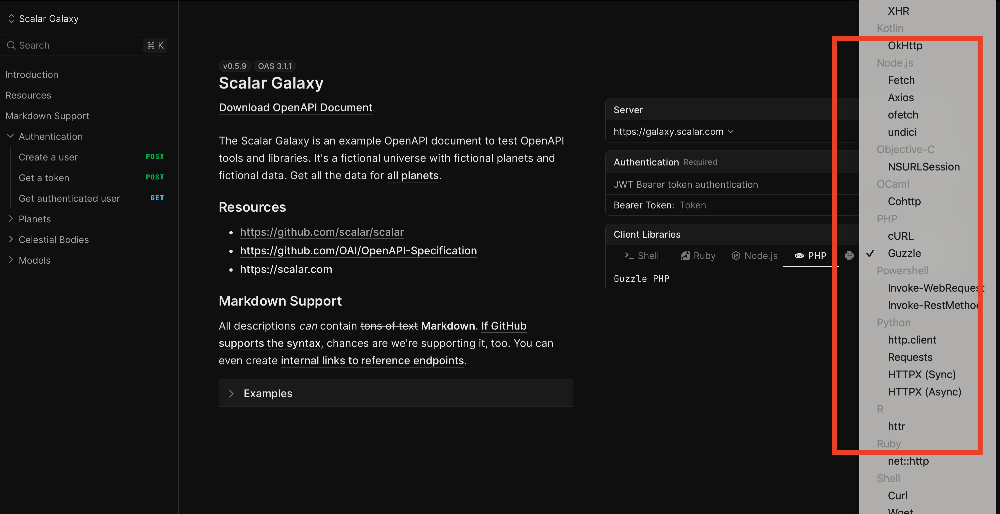
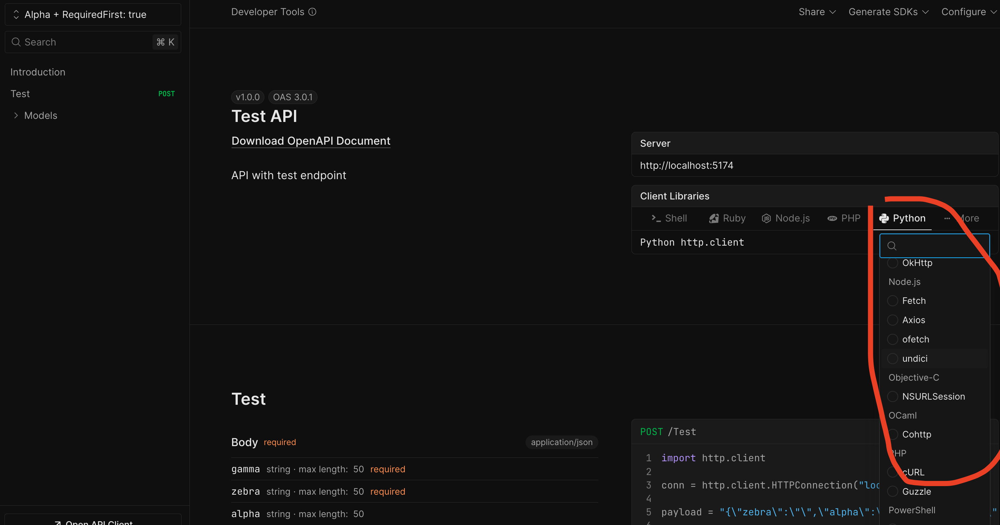

## Metadata (not to include in the student issue)

- PR Link: https://github.com/scalar/scalar/pull/6322/files
- Issue link: NA
- Tool: https://openbootstrap.onrender.com/pr/scalar/scalar/6322

# Replace native select with combobox component in client libraries card

## Motivation

The client libraries card currently uses a native HTML `<select>` dropdown to allow users to choose from additional programming language clients beyond the featured ones. Native select elements have limited styling capabilities and provide an inconsistent user experience across different browsers and operating systems. They also don't integrate well with modern design systems.

By replacing the native select with a custom combobox component from the Scalar component library, we can provide a more polished, consistent user experience that matches the rest of the application's design system. This also gives us better control over accessibility, keyboard navigation, and visual presentation while maintaining the same functionality.

## Current Behavior

The client libraries selector displays featured language clients as individual tabs, with a native HTML `<select>` dropdown for accessing all other available clients. The select element uses `<optgroup>` tags to group clients by their target language/platform.

**Reproduction Steps:**
1. Navigate to any API reference page that displays client libraries
2. Observe the client selector UI showing featured clients (like Shell, JavaScript, Python) as tabs
3. Look for the dropdown selector (typically labeled "More") that contains additional client options
4. Click on the dropdown and observe it uses a native browser select element
5. Notice the select options are grouped by language/platform using optgroups
6. Select a non-featured client from the dropdown
7. Observe: The native select has limited styling and doesn't match the application's design system

## Expected Behavior

The client libraries selector should use the `ScalarCombobox` component instead of a native HTML select element, providing a consistent, styled experience that integrates with the Scalar design system.

**Acceptance Criteria:**
- [ ] The native `<select>` element is replaced with `ScalarCombobox` component from `@scalar/components`
- [ ] All available client options remain accessible through the combobox with proper grouping by language/platform
- [ ] Selecting a client from the combobox updates the active client state correctly
- [ ] The currently selected client is properly reflected in the combobox display
- [ ] The combobox maintains the same functionality as the previous select element (users can switch between all available clients)

## Verification

**Manual Testing:**
1. Run the development server and navigate to an API reference page with client libraries
2. Verify the client selector displays featured clients as tabs and a combobox for additional options
3. Click on the combobox and verify it opens with all available clients grouped by language/platform
4. Select different clients from the combobox and verify the code snippet updates accordingly
5. Verify the combobox displays the currently selected client's name
6. Test keyboard navigation within the combobox
7. Verify the UI is consistent with the rest of the Scalar design system

**Automated Testing:**
- Run existing test suite: `pnpm test`
- Verify all existing tests pass and component behavior is unchanged
- Check that the component properly handles client selection state

### Submission
Download https://cap.so/ to record your screen (use Studio mode). Export as an mp4, and drag and drop into an issue comment below.

Guide to submitting pull requests: https://hackmd.io/@timothy1ee/Hky8kV3hlx