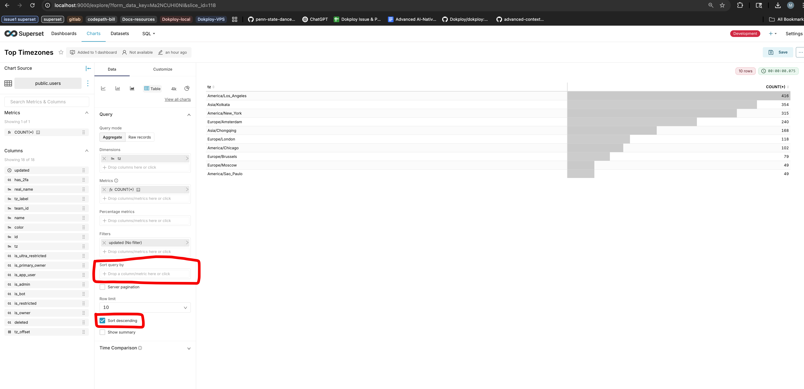
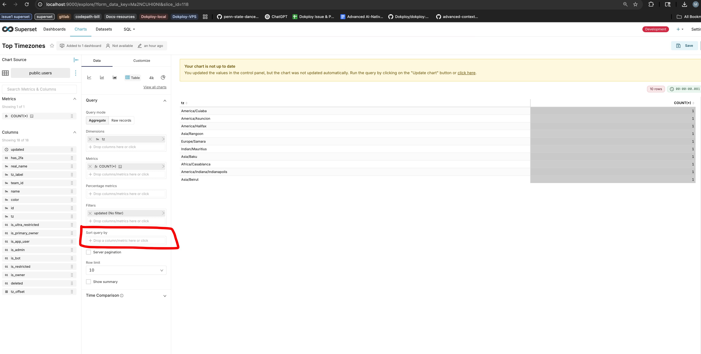
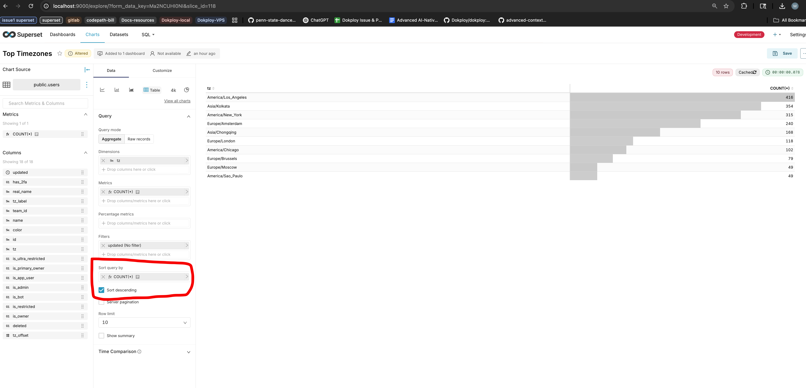

## Metadata

- **Tool:** [OpenBootstrap](https://openbootstrap.onrender.com/pr/apache/superset/33540)
- **PR:** [apache/superset#33540](https://github.com/apache/superset/pull/33540)
- **Issue:** N/A

# Table Chart "Sort Descending" control appears when no sort metric is selected and has a confusing UI location

## Motivation

The Table Chart control panel has a confusing user experience where the "Sort Descending" checkbox is always visible, even when no "Sort Query By" metric is selected. This creates a misleading interaction: users can toggle the "Sort Descending" checkbox, but it has no effect on the results when there's no sort metric chosen. The controls are also visually separated by the server pagination options, making their relationship unclear.

This confusion stems from the underlying query logic: when no sort metric is explicitly selected, the system defaults to sorting by the first metric in ascending order, completely ignoring the "Sort Descending" checkbox state. Users expect their input to be respected, but the UI allows them to interact with a control that has no effect in certain states. Improving this interaction will make the control panel more intuitive and prevent users from wasting time trying to understand why their sorting preference isn't being applied.

## Current Behavior

The "Sort Descending" checkbox is always visible in the Table Chart control panel, regardless of whether a "Sort Query By" metric has been selected. Also, the checkbox appears below the server pagination controls, visually separated from the "Sort Query By" control it depends on.

When users toggle the "Sort Descending" checkbox without selecting a "Sort Query By" metric, the checkbox state changes but has no effect on the table results. This creates a confusing experience where the UI suggests functionality that doesn't actually work in that state.

**Reproduction Steps:**
1. Start Superset locally by running `docker compose up --build` in your forked Codepath Superset repository. Once the services are running, open `localhost:9000` in your browser to access the Superset UI.
  - Note: `--build`:  getting docker compose to fire up services, and rebuilding if some docker layers have changed using the `--build` suffix may be slower and optional if layers like py dependencies haven't changed
  - This may take a few moments to start.
docker compose up --build 
2. Navigate to `Charts > Top Timezones`.
2. In the control panel, ensure no metric is selected in the "Sort Query By" control.
3. Locate the "Sort Descending" checkbox (Observe: it appears below the server pagination controls).
4. Toggle the "Sort Descending" checkbox on and off.
5. Run the query and observe the table results.
6. Observe: The table sorting does not change when toggling "Sort Descending" without a "Sort Query By" metric selected, even though the checkbox is interactive and visible.
7. Select a metric in "Sort Queue By" Control and toggle the "Sort Descending". Observe the functionality working as expected.

## Screenshot: Current UI ("Sort Descending" Always Visible)

## Expected Behavior

The "Sort Descending" checkbox should only be visible when a "Sort Query By" metric is selected, making it clear that these two controls work together. The checkbox should be positioned directly below the "Sort Query By" control to visually indicate their relationship.

When no "Sort Query By" metric is selected, the "Sort Descending" checkbox should be hidden, preventing users from interacting with a control that has no effect. When a sort metric is selected, the checkbox should appear and allow users to control the sort direction.

### Screenshot: Expected UI ("Sort Descending" Hidden When No Sort Metric Selected)

### Screenshot: Expected UI ("Sort Descending" Visible and Correctly Positioned)

**Acceptance Criteria:**
- [ ] The "Sort Descending" checkbox is positioned directly below the "Sort Query By" control in the control panel
- [ ] The "Sort Descending" checkbox is hidden when no "Sort Query By" metric is selected
- [ ] The "Sort Descending" checkbox becomes visible when a "Sort Query By" metric is selected
- [ ] The checkbox visibility logic only applies when in aggregation mode (existing behavior should be preserved)
- [ ] When visible, the "Sort Descending" checkbox functions correctly to control sort direction

## Verification

**Manual Testing:**
1. Create or edit a Table Chart in Superset
2. Verify the "Sort Descending" checkbox is hidden when no "Sort Query By" metric is selected
3. Select a metric in the "Sort Query By" control
4. Verify the "Sort Descending" checkbox appears directly below the "Sort Query By" control
5. Toggle the checkbox and run the query to confirm it affects the sort direction
6. Clear the "Sort Query By" metric selection
7. Verify the "Sort Descending" checkbox disappears again
8. Test with server pagination enabled and disabled to ensure the controls are properly positioned in both cases

**Expected Results:**
- The control panel layout should clearly show the relationship between "Sort Query By" and "Sort Descending"
- Users should not be able to interact with the "Sort Descending" checkbox when it has no effect
- All existing table chart functionality should continue to work as before
