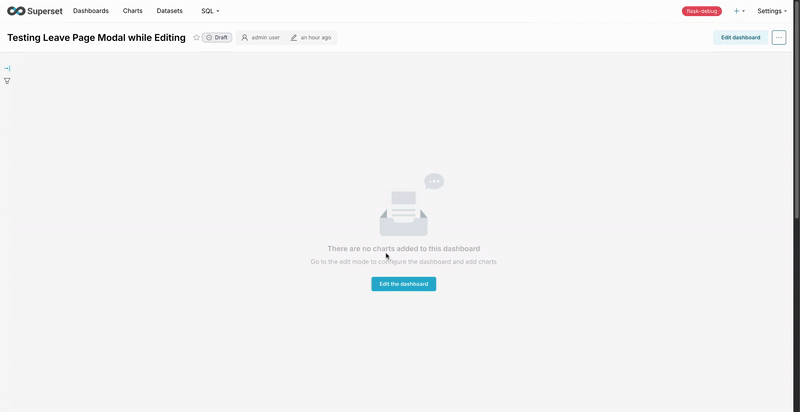

## Metadata

- **Tool:** [OpenBootstrap](https://openbootstrap.onrender.com/pr/apache/superset/338090)
- **PR:** [apache/superset#338090](https://github.com/apache/superset/pull/338090)
- **Issue:** N/A

# Add confirmation modal for unsaved changes in Dashboard and Explore sections

## Motivation

Users can lose work when navigating away from the Dashboard editing view or Explore section without saving their changes. This creates a frustrating experience where modifications to charts, filters, or dashboard layouts are silently discarded when users click to a different section of the application. 

A confirmation modal that alerts users about unsaved changes before navigation provides a safety net, allowing them to either save their work or consciously choose to discard it. This improves the user experience by preventing accidental data loss and giving users explicit control over their workflow.

## Current Behavior

Currently, when users make changes in the Dashboard editing view or Explore section and attempt to navigate away (for example, by clicking on "Datasets" in the navigation menu), the application allows the navigation without any warning. All unsaved changes are lost without user confirmation.

**Reproduction Steps:**

1. Navigate to an existing Dashboard or create a new one
2. Make a change without saving (e.g., add a chart, modify a filter, or adjust the layout)
3. Click on a different section in the navigation menu (e.g., "Datasets")
4. Observe: The navigation occurs immediately and all changes are lost without any warning or confirmation

**Alternative scenario for Explore:**

1. Navigate to the Explore section
2. Make changes to chart configuration, filters, or metrics
3. Attempt to navigate to another section (e.g., "Datasets")
4. Observe: Changes are lost without confirmation

## Expected Behavior

When users attempt to navigate away from Dashboard editing or Explore sections with unsaved changes, a confirmation modal should appear, prompting them to make an explicit choice about their unsaved work.

**Acceptance Criteria:**

- [ ] A confirmation modal appears when navigating away from Dashboard editing with unsaved changes
- [ ] A confirmation modal appears when navigating away from Explore section with unsaved changes
- [ ] The modal provides two clear options: "Save" and "Discard"
- [ ] Clicking "Save" triggers the standard save flow for the respective section
- [ ] Clicking "Discard" allows navigation to proceed and discards all unsaved changes
- [ ] The modal can be dismissed (closed) without taking action, keeping the user on the current page
- [ ] The modal displays appropriate messaging explaining that unsaved changes will be lost

## Verification

**Manual Testing:**

1. **Dashboard Editing Flow:**
   - Open an existing dashboard or create a new one
   - Add a chart or make any modification
   - Click to navigate to "Datasets" or another section
   - Verify a modal appears with "Save" and "Discard" options
   - Click "Save" and verify the dashboard saves successfully
   - Repeat and click "Discard" to verify navigation proceeds without saving

2. **Explore Section Flow:**
   - Navigate to Explore
   - Modify chart configuration (change metrics, filters, etc.)
   - Attempt to navigate away
   - Verify the confirmation modal appears
   - Test both "Save" and "Discard" actions work correctly

3. **Modal Dismissal:**
   - Trigger the modal in either section
   - Click the close button (X) or outside the modal
   - Verify you remain on the current page with changes intact

**Automated Testing:**

Verify all tests pass, particularly:
- Modal renders when `showModal` is true
- Modal does not render when `showModal` is false
- "Save" button triggers the save handler
- "Discard" button triggers the navigation confirmation handler
- Modal can be dismissed without triggering save or discard actions

### Submission
Download https://cap.so/ to record your screen (use Studio mode). Export as an mp4, and drag and drop into an issue comment below.

Guide to submitting pull requests: https://hackmd.io/@timothy1ee/Hky8kV3hlx